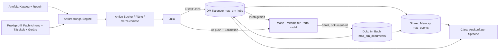
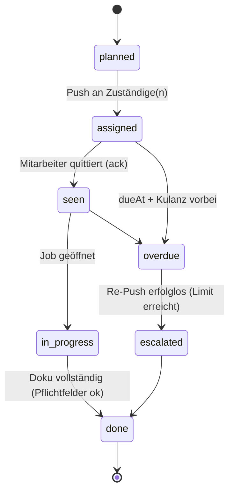

# Julia — QM-Job-System (Konzept & Architektur)

Stand: 2026-06-23. Kanonisches Spezifikationsdokument für das Qualitätsmanagement
rund um die KI **Julia**. `inherited/KONZEPT-AUFGABEN-MEMORY-CHAT.md` und der
Altordner `F:\POST-KI` dienen nur als **Ideengeber** — kein Code wird übernommen
(der Altstand war konzeptionell weit, aber kaputt programmiert).

Leitplanken aus `ARCHITECTURE.md` gelten unverändert: multi-tenant, MAS-2 schreibt
ausschließlich nach `clients/{clientId}/mas_*`, Clara spricht nur über
Fakten-Tools (HTTP), Verträge (`/brain/*`, `/clara/*`, `/testtrain/*`) werden nur
erweitert, nie gebrochen.

---

## 1. Was Julia ist und tut

Julia ist die **QM-Agentin**. Sie hat **keinen Team-Chat** (bewusst entfernt).
Stattdessen:

1. **erkennt**, welche Bücher / Pläne / Verzeichnisse eine Praxis führen muss
   (abhängig von Fachrichtung + Tätigkeit operativ/konservativ + Geräten),
2. **erzeugt eigenständig Jobs** aus diesen Büchern/Plänen (wiederkehrend und
   einmalig) und trägt sie in ihren **eigenen QM-Kalender** ein,
3. **verteilt Jobs gezielt per Push** an die zuständigen Mitarbeiter,
4. **verfolgt** jeden Job und **pusht erneut**, bis er erledigt ist (mit
   Eskalation, nicht endlos),
5. schreibt **alles** (Job, Zustand, Erledigung, Dokumentation) in das jeweilige
   **Buch als Doku-Datei** und in das **Shared Memory** (`mas_events`),
6. macht damit **Clara auskunftsfähig**: Clara liest den QM-Kalender + das
   Gedächtnis und beantwortet Fragen wie „Wann ist die nächste OPG-Konstanz-
   prüfung fällig?“ oder „Wer hat zuletzt den Notfallkoffer geprüft?“.



---

## 2. Datenmodell (alles unter `clients/{clientId}/mas_*`)

| Collection | Zweck | Lebensdauer |
|---|---|---|
| `mas_qm_profile` (Doc `current`) | Praxisprofil: Fachrichtung, Tätigkeiten, Geräte, Flags | dauerhaft |
| `mas_qm_books` | aktivierte Bücher/Pläne/Verzeichnisse pro Praxis (Status, Verantwortliche, Version) | dauerhaft |
| `mas_qm_jobs` | **der QM-Kalender** — jeder Job = ein Kalendereintrag | dauerhaft (Audit) |
| `mas_qm_schedules` | Wiederholungsregeln (RRULE) je Buch/Job-Vorlage | dauerhaft |
| `mas_qm_documents` | Doku-Dateien je Buch (append-only Nachweise) | dauerhaft (Audit) |
| `mas_staff` | Mitarbeiter (Name, Funktion, Rollen, Aufgabenbereiche, Push-Token, Abwesenheit) | dauerhaft |
| `mas_events` | Shared Memory — bestehend, Julia hängt QM-Events an | s. Retention |

**Global (kein Tenant-Datum, als Backend-JSON in `backend/src/data/qm/`):**

| Datei | Zweck |
|---|---|
| `qm-artifacts.json` | Katalog aller möglichen Bücher/Pläne/Verzeichnisse |
| `qm-rules.json` | Aktivierungsregeln (wann ein Artefakt nötig wird) |
| `qm-fachrichtungen.json` | Default-Profile pro Fachrichtung (Vorbelegung) |

> Katalog + Regeln sind Stammwissen, kein Mandantendatum → versioniert im Code,
> nicht pro Praxis kopiert. Pro Praxis wird nur das **Ergebnis** (`mas_qm_books`)
> und das **Profil** (`mas_qm_profile`) gespeichert.

### 2.1 Job (`mas_qm_jobs`) — der Kalendereintrag

```json
{
  "id": "uuid",
  "clientId": "…",
  "bookKey": "constancy_book",
  "title": "Konstanzprüfung OPG",
  "purpose": "Gesetzliche Konstanzprüfung des OPG-Geräts (RöV/StrlSchG)",
  "deviceRef": "opg-1",
  "category": "patientensicherheit",

  "scheduledFor": "2026-07-01T08:00:00+02:00",
  "dueAt": "2026-07-01T18:00:00+02:00",
  "leadDays": 7,

  "assignedRole": "strahlenschutzbeauftragte",
  "assignedTo": "staff_saghi",
  "assignedToName": "Saghi",

  "status": "assigned",
  "ackAt": null,
  "startedAt": null,
  "completedAt": null,
  "completedBy": null,
  "completedByName": null,

  "recurrenceId": "sched_opg_konstanz",
  "recurrenceMode": "anchor_on_completion",

  "requiredFields": [
    { "key": "ergebnis", "label": "Prüfergebnis", "type": "enum", "options": ["bestanden","nicht_bestanden"] },
    { "key": "pruefwert", "label": "Messwert", "type": "number" },
    { "key": "foto", "label": "Foto Prüfprotokoll", "type": "file", "required": false }
  ],
  "resultDocId": null,

  "pushState": { "sentCount": 0, "lastSentAt": null, "channel": null },
  "escalation": { "level": 0, "escalatedTo": null, "escalatedAt": null },

  "createdBy": "julia",
  "createdAt": "…",
  "updatedAt": "…"
}
```

### 2.2 Doku-Datei (`mas_qm_documents`) — append-only Nachweis

```json
{
  "id": "uuid",
  "clientId": "…",
  "bookKey": "constancy_book",
  "jobId": "…",
  "deviceRef": "opg-1",
  "performedBy": "staff_saghi",
  "performedByName": "Saghi",
  "performedAt": "2026-07-01T09:12:00+02:00",
  "fields": { "ergebnis": "bestanden", "pruefwert": 1.4 },
  "attachments": ["mas_qm/opg-1/2026-07-01-protokoll.pdf"],
  "planVersion": null,
  "hash": "sha256:…",
  "createdAt": "…"
}
```

> **Append-only, nie löschen.** Korrekturen kommen als neuer Eintrag mit Verweis
> auf den alten (`correctsDocId`). Das ist das, was bei einer KV-/Gesundheitsamt-
> Begehung vorgelegt werden muss.

---

## 3. Anforderungs-Engine — welche Bücher/Pläne werden nötig?

Kern: **keine 50×20-Matrix**, sondern eine deklarative Regel-Engine. Fachrichtung
liefert nur **Defaults**; die finale Liste entsteht aus Regeln + Praxis-Merkmalen.

### 3.1 Praxisprofil (`mas_qm_profile`)

```json
{
  "fachrichtung": "zahnmedizin",
  "sector": "zahnarzt",
  "activities": { "konservativ": true, "operativ": true, "invasiv": true, "diagnostisch": true },
  "capabilities": {
    "roentgen": true,
    "labor_eigen": false,
    "eigene_sterilisation": true,
    "ambulant_operieren": false,
    "narkose_sedierung": false,
    "impfstoff_kuehlschrank": false,
    "notfallkoffer": true,
    "medizinprodukte_aktiv": true,
    "infektioes_hoch": false
  }
}
```

> `operativ`/`konservativ` sind **Tätigkeits-Merkmale**, keine Fachrichtungen.
> Ein Hausarzt kann beides; ein Oralchirurg fast nur operativ.

### 3.2 Artefakt-Katalog (`qm-artifacts.json`)

```json
{
  "key": "constancy_book",
  "type": "book",
  "category": "patientensicherheit",
  "title": "Konstanzprüfungsbuch (Röntgen)",
  "legalBasis": ["StrlSchG", "RöV"],
  "hasInterview": false,
  "defaultCycle": "yearly",
  "recurrenceMode": "anchor_on_completion",
  "requiredFields": ["ergebnis", "pruefwert"],
  "exportFormats": ["pdf", "csv"]
}
```

Typen: `plan` (Hygiene-, Notfall-, Hautschutz-, Reinigungsplan), `book`
(Sterilisation, Konstanz, Temperatur), `register` (Gefahrstoff-, Biostoff-,
Fortbildungsverzeichnis), `handbook` (QM-Handbuch).

### 3.3 Regeln (`qm-rules.json`)

```json
[
  { "artifactKey": "hygiene_plan", "required": "always", "when": { "sector": ["arzt","zahnarzt"] } },
  { "artifactKey": "sterilisation_log", "required": "conditional",
    "when": { "any": [ { "capability": "eigene_sterilisation", "eq": true } ] },
    "reason": "Eigene Aufbereitung → Chargendokumentation Pflicht" },
  { "artifactKey": "constancy_book", "required": "conditional",
    "when": { "any": [ { "capability": "roentgen", "eq": true } ] },
    "reason": "Röntgenbetrieb → Konstanzprüfung Pflicht" },
  { "artifactKey": "temperature_log", "required": "conditional",
    "when": { "capability": "impfstoff_kuehlschrank", "eq": true } }
]
```

Regel-Typen: `always` (Baseline im Sektor), `conditional` (nur wenn Merkmal
zutrifft), `recommended` (Julia schlägt vor, Mensch bestätigt), `never`
(explizit ausgeschlossen).

### 3.4 Resolver

```
resolveQmRequirements(profile) ->
  baseline   = always-Regeln, die zum sector passen
  conditional= conditional-Regeln, deren when(profile) true ist
  recommended= recommended-Regeln, deren when(profile) true ist
  => dedupe + Artefakt-Metadaten + Begründung
```

Ergebnis je Artefakt: `required | recommended | optional` mit **Begründung**
(für die KV-Begehung nachvollziehbar). Wird die Praxis später erweitert (z. B.
Autoklav angeschafft → `eigene_sterilisation=true`), schlägt die Engine das
Sterilisationsbuch automatisch vor.

### 3.5 Smartes Hinterfragen (Onboarding durch Julia)

- **Phase A — harte Fakten (5–8 Fragen):** Röntgen? Eigene Sterilisation? Ambulante OP/Narkose? Eigenes Labor? Impfstoff-Kühlschrank? Notfallkoffer? — aus Fachrichtung vorbefüllt, nur Abweichung bestätigen.
- **Phase B — Engine ausführen:** Liste Pflicht / empfohlen / nicht nötig mit Begründung; User aktiviert.
- **Phase C — Detail-Interview:** nur für Artefakte mit `hasInterview:true` (z. B. Hygieneplan) → Wizard → Parameter → Plangenerierung → Schedules.

---

## 4. Job-Lebenszyklus (Statusmodell)

Re-Push braucht Zwischenstufen — sonst pusht Julia jemanden, der schon dran ist.



- **`seen` ≠ `done`.** Quittierung trennt „gesehen/angenommen“ von „erledigt“.
- **Re-Push-Kadenz hängt vom Status ab:** lautlos bei `in_progress`, eskalierend
  bei `overdue`.
- **`done` nur mit vollständigen `requiredFields`** → erzeugt automatisch den
  Eintrag in `mas_qm_documents` und ein `qm_job_done`-Event.

---

## 5. Wiederholung (Schedules)

`mas_qm_schedules` nutzt **iCal-RRULE** statt selbstgebauter Felder.

```json
{
  "id": "sched_opg_konstanz",
  "bookKey": "constancy_book",
  "title": "Konstanzprüfung OPG",
  "rrule": "FREQ=YEARLY;INTERVAL=1",
  "leadDays": 7,
  "assignedRole": "strahlenschutzbeauftragte",
  "mode": "anchor_on_completion",
  "active": true
}
```

Zwei Modi — bewusst getrennt:

| Modus | Beispiel | Nächste Fälligkeit |
|---|---|---|
| `fixed` | Temperaturliste täglich | feststehend, unabhängig von Erledigung |
| `anchor_on_completion` | Konstanzprüfung „1 Jahr nach letzter“ | erst bei `done` neu berechnet |

UI (Julia-Seite): Erinnerungen pro Buch **selbst anlegen / bearbeiten / löschen**
(täglich, wöchentlich, monatlich, vierteljährlich, jährlich), optional
zugewiesene Person/Rolle. Ein **Scheduler-Tick** (Cron) materialisiert fällige
Schedules zu konkreten `mas_qm_jobs`, mit Vorlauf (`leadDays`).

---

## 6. Zuweisung, Eskalation, Vertretung

### 6.1 Rollenbasierte Zuweisung (`mas_staff`)

```json
{
  "id": "staff_saghi",
  "name": "Saghi",
  "funktion": "Sterilgutassistentin",
  "roles": ["hygienebeauftragte", "strahlenschutzbeauftragte"],
  "aufgabenbereiche": ["sterilisation", "konstanzpruefung", "notfallkoffer"],
  "deputyOf": [],
  "deputy": "staff_lena",
  "pushTokens": ["…"],
  "absences": [ { "from": "2026-07-10", "to": "2026-07-20" } ]
}
```

Julia schlägt `assignedTo` aus `assignedRole` + `aufgabenbereiche` vor.
Rollen: Strahlenschutz-, Datenschutz-, Hygiene-, QM-, Brandschutz-,
Sicherheits-, Infektionsschutzbeauftragte/r, Ersthelfer, Vertrauensperson.

### 6.2 Abwesenheit & Vertretung

- Julia weist **nicht** an jemanden zu, der laut `absences` abwesend ist →
  Vertretung (`deputy`) bekommt den Job. Baustein vorhanden: `absencePlanner.js`.

### 6.3 Eskalationsstufen (statt endlosem Push)

| Stufe | Auslöser | Aktion |
|---|---|---|
| 0 | Job zugewiesen | Push an Zuständige(n) |
| 1 | dueAt + Kulanz, nicht `seen` | erneuter Push, lauter |
| 2 | N Pushes erfolglos | an **Vertretung** |
| 3 | weiter offen | an **Praxisleitung** + Markierung „kritisch überfällig“ |

Re-Push hat eine **Obergrenze** → danach eskalieren, nicht spammen.

---

## 7. Push & Mitarbeiter-Portal (Marie, mobil)

Marie ist das **Mitarbeiter-Portal** (mobil, getrennt vom Leitstellen-Monitor).
Mitarbeiter sehen nur **„Meine Aufgaben“** (`assignedTo == ich`), kein Zugriff
auf alles.

- **Primärkanal Web-Push (PWA)** — kein App-Store, läuft auf iPhone/Android.
- **Fallback SMS** (über Lisa/smsflatrate), wenn kein Push-Token oder „nicht
  gesehen“ nach Stufe 1.
- **Ruhezeiten** (z. B. 20–7 Uhr) respektieren — kein Nacht-Push für „morgen
  fällig“.
- **Ablauf:** Push → Mitarbeiter öffnet Job → `ack` (Status `seen`) → öffnet
  (`in_progress`) → füllt Pflichtfelder/Checkliste/Wert/Foto → **erledigt**
  (`done`). Daten fließen in `mas_qm_documents` + `mas_events`, Kalender zeigt
  **„erledigt von Saghi, 09:12“**.
- **KI-Hilfe pro Job:** Button „Was tun?“ → Clara/Julia geben konkrete Schritte
  zur Aufgabe (Job-Typ + Buch als Kontext).

API (mobil): `GET /clara/qm/my-jobs?staffId=…`,
`POST /clara/qm/jobs/:id/ack`, `POST /clara/qm/jobs/:id/complete` (mit Nutzdaten).

---

## 8. Julias Kalender + Clara liest ihn

**Eigener QM-Kalender** (`mas_qm_jobs`), getrennt vom Behandlungskalender
(`locations/{id}/appointments`, den MAS-2 nur liest). Im Behandlungskalender
**nicht** vermischt — optional als ein-/ausblendbarer Overlay-Layer in der UI.

### 8.1 Neuer Clara-Lese-Endpunkt (Tool)

```
GET /clara/qm/calendar?clientId=…&from=…&to=…&bookKey=…&deviceRef=…
GET /clara/qm/next-due?clientId=…&bookKey=constancy_book&deviceRef=opg-1
GET /clara/qm/history?clientId=…&bookKey=…&deviceRef=…&limit=…
```

Das ist additiv unter dem `/clara/*`-Vertrag — bestehende Routen bleiben
unangetastet. Clara bekommt strukturierte Fakten und formuliert nur.

### 8.2 Beispiel-Dialoge (Fakten kommen aus den Tools)

- **„Clara, wann ist die nächste OPG-Konstanzprüfung fällig?“**
  → `GET /clara/qm/next-due?bookKey=constancy_book&deviceRef=opg-1`
  → „Die nächste Konstanzprüfung des OPG ist am ersten Juli fällig, zuständig ist Saghi.“
- **„Wer hat zuletzt den Notfallkoffer geprüft?“**
  → `GET /clara/qm/history?bookKey=emergency_checklist&limit=1`
  → „Zuletzt am dritten Juni von Saghi, Ergebnis vollständig.“
- **„Was ist diese Woche im QM fällig?“**
  → `GET /clara/qm/calendar?from=…&to=…`.

---

## 9. Shared-Memory-Integration (`mas_events`)

Julia hängt QM-Events an die bestehende, append-only Timeline. Neue Event-Typen
(additiv zu `EVENT_TYPES`):

| Event-Typ | Wann | Inhalt |
|---|---|---|
| `qm_job_created` | Julia legt Job an | bookKey, title, dueAt, assignedTo |
| `qm_job_assigned` / `_reassigned` | Push / Vertretung | von/an wen, Grund |
| `qm_job_seen` | ack | wer, wann |
| `qm_job_done` | erledigt | wer, wann, resultDocId, fields-Kurzfassung |
| `qm_job_escalated` | Eskalation | Stufe, an wen |
| `qm_plan_updated` | Plan-Version | bookKey, version, von wem |

Damit ist „wer hat was wann gemacht“ vollständig im Gedächtnis — und Clara kann
ohne Team-Chat Auskunft geben. Erledigung nutzt das vorhandene Muster
(`resolveItem`): Statuswechsel am Job **plus** unveränderliches Audit-Event.

---

## 10. API-Oberfläche (additiv, Vertrag nicht brechen)

```
# Profil & Anforderungen
GET  /clara/qm/requirements?clientId=…         -> berechnete Buch-/Planliste + Begründung
POST /clara/qm/profile                          -> Merkmale speichern + neu berechnen

# Bücher / Pläne
GET  /clara/qm/books?clientId=…                 -> aktive Bücher (Status, Verantwortliche, Version)
POST /clara/qm/books/:key/activate
POST /clara/qm/books/:key/document              -> Doku-Eintrag (append-only)
GET  /clara/qm/books/:key/export?format=pdf|csv

# Schedules (Wiederholungen)
GET/POST/PATCH/DELETE /clara/qm/schedules

# Jobs / Kalender
GET  /clara/qm/calendar | /next-due | /history
GET  /clara/qm/my-jobs?staffId=…
POST /clara/qm/jobs/:id/ack | /complete | /reassign

# Begehungs-Export
GET  /clara/qm/audit-pack?clientId=…&from=…&to=…  -> Prüfmappe (alle Bücher + Nachweise als PDF-Bündel)
```

---

## 11. Guardrails (Julia darf autonom, aber prüfbar)

- **Autonomie + Nachweis:** Julia legt Jobs eigenständig an, **jeder** Schritt
  wird in `mas_events` protokolliert (kein Team-Chat nötig, Nachweis bleibt).
- **Aktivierung von Büchern bleibt menschlich freigegeben** (Phase B des
  Onboardings) — auditierbar und reproduzierbar, nicht „LLM-geraten“.
- **Tenant + Entitlement** bei jedem Tool-Aufruf (QM-Modul über `masModules`).
- **Append-only** für Jobs (Statuswechsel + Event) und Dokumente — keine harten
  Löschungen; Korrektur nur als neuer, verweisender Eintrag.

---

## 12. Vergessene/ergänzte Punkte (Checkliste)

- [x] **Statusmodell** mit `seen` getrennt von `done` (Re-Push-Logik).
- [x] **Eskalation + Vertretung + Abwesenheit** (war im Altkonzept nicht).
- [x] **RRULE-Wiederholung** mit `fixed` vs. `anchor_on_completion`.
- [x] **Pflichtfelder pro Job** → kein „erledigt“ ohne Nachweis.
- [x] **Vorlauf-Erinnerung** (`leadDays`), nicht erst bei Überfälligkeit.
- [x] **Audit-Trail / append-only / Prüfmappen-Export** für Begehung.
- [x] **Lesebestätigung/Unterweisung** bei Plan-Updates (`qm_plan_updated` →
      Job „Plan vX lesen & bestätigen“).
- [x] **Push-Fallback + Ruhezeiten**.
- [ ] **MVZ/Mehr-Standort:** Profil = Union der Abteilungen, Jobs pro Standort
      (`locationId`) — Stufe 3.
- [ ] **KPIs/Dashboard** für Praxisleitung (Erledigungsquote, Überfällige) —
      später.
- [ ] **Trigger aus anderen Agenten:** Beschwerde (Bianca/Lisa) → CIRS-Eintrag,
      Wartung → Medizinproduktebuch-Eintrag.

---

## 13. Rollout in Stufen

| Stufe | Inhalt |
|---|---|
| 1 (MVP) | Profil + Engine (~15 Artefakte, ~30 Regeln, 10 Fachrichtungen), `mas_qm_books`, Job-Modell + Statusmodell, manueller Job + `done` mit Doku, `mas_events`-Events |
| 2 | Schedules (RRULE) + Scheduler-Tick, Vorlauf, Clara-Lese-Tools (`next-due`, `history`, `calendar`) |
| 3 | Marie-Portal mobil + Web-Push + SMS-Fallback + Eskalation/Vertretung/Abwesenheit |
| 4 | Hygieneplan-Wizard + Plangenerierung, Lesebestätigung, Prüfmappen-Export |
| 5 | MVZ/Mehr-Standort, KPIs, Agenten-Trigger |

---

## 14. Dateien (geplant, Neubau)

| Bereich | Datei | Zweck |
|---|---|---|
| Backend Daten | `backend/src/data/qm/qm-artifacts.json` | Artefakt-Katalog |
| Backend Daten | `backend/src/data/qm/qm-rules.json` | Aktivierungsregeln |
| Backend Daten | `backend/src/data/qm/qm-fachrichtungen.json` | Default-Profile |
| Backend | `backend/src/qm/requirements.js` | Resolver-Engine |
| Backend | `backend/src/qm/jobs.js` | Job-Lebenszyklus, Statusmodell |
| Backend | `backend/src/qm/schedules.js` | RRULE-Materialisierung (Scheduler-Tick) |
| Backend | `backend/src/qm/documents.js` | append-only Doku + Export |
| Backend | `backend/src/qm/notify.js` | Push/SMS-Versand + Eskalation |
| Backend | `backend/src/qm/calendarRead.js` | Clara-Lesemodell (`next-due`/`history`/`calendar`) |
| Backend | Routen in `server.js` | `/clara/qm/*` (additiv) |

---

## 15. Implementierungsstand (23.06.2026 — Backend-Kern gebaut)

Heute Nacht produktionsreif gebaut **und mit isolierten Test-Mandanten geprüft**
(`node scripts/run-tests.mjs qm` → 5/5 grün; Server bootet, `/clara/qm/*`
antwortet live):

**Module (neu, `backend/src/qm/`):**
- `catalog.js` — lädt Stammwissen (19 Artefakte, 20 Regeln, 10 Fachrichtungen).
- `requirements.js` — Resolver-Engine (`when`-Grammatik: sector/capability/
  activity/any/all), Status required|recommended|optional + Begründung.
- `books.js` — `mas_qm_profile` + `mas_qm_books`: Profil speichern, Anforderungen
  berechnen, Bücher (de)aktivieren, Verantwortliche/Vertretung, Versionierung.
- `documents.js` — `mas_qm_documents` **append-only** mit Pflichtfeld-Validierung,
  Integritäts-Hash (sha256), Export-Zeilen.
- `recurrence.js` (pure) — Zyklus-Vokabular + `fixed`/`anchor_on_completion`,
  Monats-Clamping, Vorlauf (`leadDays`).
- `jobs.js` — `mas_qm_jobs` mit **Statusmodell** (planned→assigned→seen→
  in_progress→done; overdue→escalated), Pflichtfeld-erzwungenes `complete`
  (erzeugt Nachweis + Audit-Event), Selbst-Folgejob bei `anchor_on_completion`,
  Re-Push-Zähler, Lesemodelle (Kalender/next-due/Historie/meine Aufgaben).
- `schedules.js` — `mas_qm_schedules` + `materializeDueJobs` (Scheduler-Tick,
  idempotent, mit Vorlauf).
- `staff.js` — `mas_staff` (Rollen, Aufgabenbereiche, Vertretung, Abwesenheiten),
  `suggestAssignee`, `resolveEscalationTarget` (Vertretung → Leitung).
- `notify.js` — Push über bestehende Geräte-Registry (`clara/devices.js`) +
  **SMS-Fallback** (Lisa) + **Ruhezeiten** (07–20 Uhr Berlin) + Eskalations-Sweep.
- `calendarRead.js` — Claras read-only Auskunft inkl. Sprach-Synonym-Mapping
  („OPG/Konstanzprüfung" → `constancy_book") **und kompletter Kalender-Lesung**:
  `buildSpokenCalendar` (überfällig + anstehend, über ALLE Bücher, mit
  Zuständigen), `buildSpokenOverdue`, sowie Buch-bezogen next-due/Historie.

**Clara liest den KOMPLETTEN Kalender (23.06.2026):** `/clara/qm/ask?q=…` routet
per Intent — überfällig | kompletter Kalender (Woche/Monat) | nächste Fälligkeit
eines Buchs | „wer hat zuletzt erledigt". Ohne erkennbares Einzelbuch liest Clara
den **gesamten** QM-Kalender vor (nicht nur Konstanzprüfung). Verdrahtet als
Clara-Voice-Custom-Tool **`qm_calendar`** in `profiles/clara_meddent/profile.json`
(GET auf `/clara/qm/ask`, `speak_result: verbatim`).

**Audit:** Jede Erledigung/Anlage/Eskalation wird zusätzlich als SYSTEM-Event
in `mas_events` geschrieben („QM: … erledigt von …") → Shared Memory.

**Routen (`server.js`, additiv):** `/clara/qm/` für fachrichtungen, profile,
requirements, books(+activate/deactivate/responsible/documents/export),
calendar, jobs(+assign/ack/start/complete/push), my-jobs, schedules,
staff(+absence), next-due, history, **ask** (Freitext → next-due|history).
Scheduler-Tick (5 min) materialisiert Schedules + fährt den Eskalations-Sweep.

**Tests:** `scripts/test-qm-requirements.mjs`, `-books`, `-jobs`, `-staff`,
`-notify`.

### Noch offen (nächste Nächte)
- [ ] **Frontend `/m/qm.html`** — mobile „Meine Aufgaben"-Ansicht (PWA): Job
      öffnen, Pflichtfelder ausfüllen, erledigen. Backend-APIs stehen
      (`/clara/qm/my-jobs`, `.../ack`, `.../start`, `.../complete`).
- [ ] **Julia-Seite** im Frontend (Bücher aktivieren, Verantwortliche, Schedules,
      Kalender-Ansicht „erledigt von").
- [x] **Clara-Voice Tool** `qm_calendar` (Profil-Custom-Tool, liest den
      kompletten Kalender) — **Release-Gate vor Worker-Neustart fahren**
      (`tools\release_gate.ps1`), dann Worker neu starten, damit das Tool greift.
- [ ] **Hygieneplan-Wizard** (Interview → Plangenerierung) + Lesebestätigung.
- [ ] **Prüfmappen-Gesamt-Export** (PDF-Bundle über alle Bücher).
- [ ] **VAPID-Keys** in MAS-2-Env (`MAS_VAPID_*`) setzen, damit QM-Push real
      sendet (sonst greift SMS-Fallback / kein Versand).
