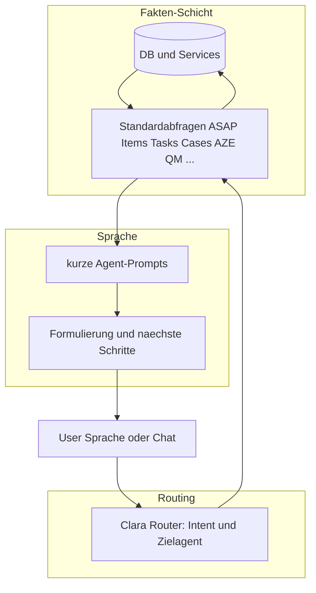

# Strategie: Clara, Sprache und alle Unter-KIs – Gesamtplan

**Stand:** 2026-03-24  
**Zweck:** Ein umfassender, runder Plan fuer alles, was fuer ein leistungsfaehiges Sprach- und Informationsinterface besprochen wurde: von Bianca/Lisa bis Querschnittsabfragen, getrennte Agenten-Prompts, Latenz und Vorgangslogik.

Verknuepfung mit bestehenden Detailplaenen:

- Telefon-Workflow Bianca–Lisa–Clara (technische Tiefe): siehe Abschnitt 7; Umsetzungspunkte deckungsgleich mit dem Cursor-Plan „Bianca-Lisa-Clara Workflow“.
- Architektur-Cuts und Legacy: [masterplan-next-cut.md](./masterplan-next-cut.md)
- Latenz: [voice-latency-architecture.md](./voice-latency-architecture.md), [voice-streaming-implementation-plan.md](./voice-streaming-implementation-plan.md)
- Regression: [voice-regression-matrix.md](./voice-regression-matrix.md), [voice-smoke-test-checklist.md](./voice-smoke-test-checklist.md)
- Aufgaben/Memory: [KONZEPT-AUFGABEN-MEMORY-CHAT.md](./KONZEPT-AUFGABEN-MEMORY-CHAT.md), [ANFORDERUNGEN-CLARA-NADINE-LENA-TASKS.md](./ANFORDERUNGEN-CLARA-NADINE-LENA-TASKS.md)
- UI-Routen, API-Cluster und Agenten-Zuordnung: [STRATEGIE-UI-API-AGENT-MATRIX.md](./STRATEGIE-UI-API-AGENT-MATRIX.md)

---

## 1. Produktvision

**Ziel:** Ueber Sprache (und Team-Chat) dieselbe **informierte** und **handlungsfaehige** Ebene erreichen wie durch Navigieren und Lesen in der UI – ohne dass der Nutzer Telefonnummern auswendig kennt oder Fakten mehrfach einzeln abfragt.

**Kernansaetze:**

- **Fakten zuerst:** Jede Antwort, die die UI aus Datenbank/APIs beantworten kann, muss fuer die KI als **strukturierte Abfrage** (Tool / Service) existieren – nicht als Hoffnung auf Memory oder Freitext-Halluzination.
- **Clara orchestriert:** Routing zur richtigen Unter-Domaene; **kein einzelner Mega-Prompt** fuer alles.
- **Getrennte System-Prompts** pro Fachrolle: Nadine, Lisa, Bianca, Lena, Julia, Marie, Sophie (und Clara selbst) – kurz, stabil, mit injizierten **Faktenbloecken** statt riesigem Regelwerk.
- **Cross-Media:** Telefon, E-Mail, Brief, Lena-Dokumentation, QM haengen am **Vorgang (Case)** mit nachvollziehbarer Verknuepfung und optional **Rolling Summary**.

---

## 2. Ist-Probleme (kurz)

| Symptom | Ursache (architektonisch) |
|--------|----------------------------|
| Aktionen nur mit expliziter Nummer/E-Mail | Entity Linking und Adressbuch-Anbindung fuer **Telefon** fehlt oder ist schwach; Call-Tasks verlangen `phone_number` ohne Aufloesung. |
| „Welche Mails/Anrufe ASAP?“ klappt nicht | Keine **eine** definierte Abfrage/Sicht wie die UI; Voice antwortet aus Chat/Memory statt aus **Work-Queue-SQL/API**. |
| Memory „wirkt nicht“ | Harte Kontextlimits, falsche/fehlende `entity_key`/Case-Zuordnung, konkurrierende Prompt-Regeln; Memory **ergaenzt** Kontext, ersetzt keine operativen Listen. |
| Nur Metadaten statt Inhalt | Roh-Ereignisse ohne **Zusammenfassungsebene**; Call-Prompts nutzen Fallkontext nicht (siehe Abschnitt 7). |
| Hohe Latenz, falsche Antworten | Sequenzielle LLM-Ketten, grosse Kontexte, fehlendes Streaming/Routing; falsche Antworten oft durch **fehlende Aufloesung** + zu viel Freiheit im Modell. |

---

## 3. Zielarchitektur: Drei Schichten

- **Schicht 1:** Deterministisch; JSON/Tabellen; gleiche Quelle wie UI.
- **Schicht 2:** Waehlt **einen oder wenige** Agenten; parallelisiert wo moeglich (z. B. ASAP = Nadine-Query + Lisa-Query).
- **Schicht 3:** Formuliert aus **gelieferten Fakten**; erfindet keine Listen.

---

## 4. Agentenmodell und Prompts

| Agent | Domäne (Kurz) | Faktenquellen (Beispiele) |
|-------|----------------|---------------------------|
| **Clara** | Orchestration, Querschnitt, Bestätigung, Geraete/Praesenz | Router; Aggregation mehrerer Tools; `team-chat`, `voice/turn` |
| **Nadine** | Posteingang, Entwuerfe, Mail, Briefe, Adressbuch, Arztbrief-Pipeline | `items`, `drafts`, `mail/*`, `address-book`, `doctor-letter-*` |
| **Lisa** | Ausgehend: Anrufe, SMS, Follow-ups, Transkripte | `tasks`, `call-reports`, Lisa-Ausfuehrung |
| **Bianca** | Eingehend: Gespraeche, Reports | `bianca/conversations`, Tasks mit inbound-Kontext |
| **Lena** | Behandlungsdokumentation, Sessions, strukturierte Felder | `lena/sessions`, Einwilligungen/JSON-Felder |
| **Julia** | QM, Hygiene, Kalender, Validierung | `qm/*` |
| **Marie** | Mitarbeiterportal, Push, Mobile-Sessions, AZE, Urlaub | `marie/*`, `mobile-sessions`, `aze/*`, `employee-portal/*`, `employees` |
| **Sophie** | Abrechnungspruefung (geplant) | zukuenftige APIs – bis dahin nicht in Sprachantworten behaupten |

**Regel:** Jeder Agent-Prompt enthaelt nur Rolle, erlaubte Aktionen, Umgang mit **mitgelieferten Daten** und Verweigerung bei fehlenden Fakten.

---

## 5. Vorgang (Case) und Cross-Media

**Ziel:** „Stand mit Klinik X / Patient Y“ aus **einem** gedachten Aktenband.

- **Roh-Timeline:** Events je Kanal (Audit, Debugging).
- **Extrahierte Fakten:** kleine Einheiten mit Quelle (Anruf, Mail, Brief).
- **Rolling Case Summary:** 3–10 Saetze, nach wichtigen Events aktualisiert; primaer fuer Voice und schnelle Antworten.

**Verknuepfungen:**

- `case_id` auf `clara_tasks`, `items` (wo vorhanden), `lena_sessions`, Bianca/Lisa-Tasks, `case_links`.
- Inbound Bianca: immer **Case** erzeugen/anhängen; Outbound Lisa: **gleiche case_id** bei Follow-up aus Bianca-Task (`source_task_id`).

**Memory:** weiter fuer Kontext und Verlauf; **operative Wahrheit** fuer „wie viele offene Mails“ kommt aus Schicht 1.

---

## 6. UI-Paritaet und Werkzeugschicht

**Anforderung:** Alles, was in der App durch Klicken und Lesen ermittelbar ist, soll ueber Clara **abfragbar** sein (lesend; schreibend nach Policy).

**Umsetzung:** Pro UI-Bereich **benannte interne APIs oder Tool-Funktionen** mit festem JSON-Schema (nicht „hoffentlich steht es im Prompt“). Die detaillierte Route-zu-Agent-Matrix wurde in der Konversation erarbeitet; bei Implementierung die Hauptcluster abdecken:

- Posteingang / Dringlichkeit / Kategorien (Nadine)
- Telefon-Tasks und Reports (Lisa/Bianca)
- Faelle / Suche / Kontext (Clara + Cases)
- QM-Faelligkeiten und Kalender (Julia)
- Lena-Sessions und strukturierte Patientendaten (Lena)
- Mitarbeiter, AZE, Push, Portal (Marie)
- Einstellungen und Export nur wo sinnvoll fuer Admin-Sprache (Clara)

**Querschnitt „ASAP“:** Eine oder zwei Server-Funktionen, die **dieselben Kriterien** wie die UI-Listen nutzen (Flags, Status, Task-Typ, Zeitfenster), plus Zusammenfuehrung durch Clara.

---

## 7. Bianca – Lisa – Clara (Telefon-Workflow, technisch)

**Nutzerbeispiele:**

- „Ruf Herrn Meier von Firma X an und sag …“ → **Nummer aus Adressbuch/Kontext**, nicht nur aus diktierten Ziffern.
- Bianca meldet dringenden Rueckruf wegen Blutwerten → Lisa ruft an mit **inhaltlicher Auskunft**, weil Labor in Nadine (Scan/Mail **Anhang**) zum **gleichen Case** gehoert.

**Bekannte Code-Luecken (Umsetzung):**

1. **Telefonaufloesung:** Symmetrisch zur E-Mail-Aufloesung im Voice-Orchestrator; Adressbuch: Namen/Firma scoren, Telefon aus Freitext-Feldern extrahieren oder spaeter strukturierte Telefonfelder; **Disambiguation** ueber Dialog-State.
2. **Call-`task_prompt`:** Heute wird bei `task_type === 'call'` der Fallkontext zugunsten „plain prompt“ verworfen – **Briefing aus Case** (und Anhangstext) in den Lisa-Prompt bringen, ohne Halluzination (Quellenangabe, fehlende Daten explizit).
3. **Briefing-Builder:** Service „Case → verknuepfte Items → Anhangstext (bestehende Extraktion) → kompaktes Faktenpaket → optionale LLM-Talking-Points“.
4. **Bianca-Ingest:** `case_id` und Thema stabil setzen; Follow-up-Tasks erben Kontext.

**Akzeptanz:** Szenarien in Golden/Smoke-Tests; keine erfundenen Laborwerte.

---

## 8. Latenz und Qualitaet

- **Streaming** der Antwort (wo unterstuetzt) fuer wahrgenommene Schnelligkeit.
- **Kleines Routing-Modell** oder schnelle Intent-Klassifikation vor dem grossen Aufruf.
- **Parallel:** Memory-Retrieval + Adressbuch + ASAP-Query gleichzeitig.
- **Kuerzerer Kontext** fuer Voice: Summary + Top-Events statt Vollhistorie.
- **Evals:** feste Fragenkataloge pro Domäne (Aufloesung, Recall aus Akte, ASAP-Liste, Latenz p50/p95).

Details und bestehende Plaene: [voice-latency-architecture.md](./voice-latency-architecture.md).

---

## 9. Compliance und Sicherheit (Kurz)

- Telefonische **Auskunft** zu Befunden: fachlich und rechtlich mit Praxis-Prozess abstimmen; technisch **nur aus extrahierten/verifizierbaren Quellen** formulieren.
- **Keine** Erfindung von Messwerten oder Kontaktdaten.
- Rollen und Berechtigungen: Tools nur mit gleicher Logik wie UI-APIs (Auth, Scope).

---

## 10. Roadmap (phasenweise)

| Phase | Inhalt | Erfolgskriterium |
|-------|--------|-------------------|
| **P0** | ASAP-/Work-Queue-Abfragen (Nadine + Lisa/Bianca) als **eine** serverseitige Schicht; Clara aggregiert | Frage „was ist dringend?“ = gleiche Substanz wie relevante UI-Listen |
| **P1** | Telefon-Entity-Linking + Dialog bei Mehrdeutigkeit; SMS analog | „Ruf X bei Y an“ ohne diktierte Nummer wenn im Adressbuch |
| **P2** | Case-Briefing fuer **Call-Tasks** inkl. Item-Anhaenge; Fix „plain call prompt“ | Lisa-Prompt enthaelt relevante Fakten aus Akte |
| **P3** | Bianca → Case → Lisa-Follow-up durchgaengig; Rolling Summary (MVP) | Ein Satz „Stand der Sache“ ueber Kanäle hinweg |
| **P4** | Router + getrennte Prompt-Dateien pro Agent; Reduktion Mega-Kontext | Stabilere Antworten, klarere Zustaendigkeiten |
| **P5** | UI-Paritaet: restliche Cluster als Tools (Marie AZE, Julia, Lena-Detailfragen, …) | „Alles wie Klick“ fuer definierte Bereiche abgedeckt |
| **P6** | Sophie: sobald Domäne und APIs existieren | In Strategie nachziehen |

Sophie bleibt bis P6 **explizit ausgeschlossen** fuer inhaltliche Spruch-Aussagen ohne Backend.

---

## 11. Naechste konkrete Schritte (Engineering)

1. P0 + P1 + P2 aus Tabelle priorisieren (hochster UX-Hebel fuer Telefon + Dringlichkeit).
2. Briefing-Helfer und Orchestrator-Aenderungen wie in Abschnitt 7 umsetzen.
3. Golden Cases und Smoke um **Aufloesung**, **Briefing**, **ASAP** erweitern.
4. Prompt-Modularisierung (P4) schrittweise; nicht alles in einem Refactoring.

---

## 12. Abdeckung der Diskussion (Checkliste)

| Thema | In diesem Dokument |
|-------|---------------------|
| Sprachinterface als Verkaufskritisch | Abschnitt 1, 2, 8 |
| Adressbuch / „Mega-Adressbuch“ / Entity Linking | 2, 4, 6, 7 |
| Memory vs. operative Daten | 2, 5, 6 |
| Cross-Media (Telefon + Mail + Anhang) | 5, 7 |
| Getrennte Prompts Nadine/Lisa/Bianca/Lena/Julia/Marie/Sophie | 4 |
| Clara fragt alle KIs / UI-Paritaet | 6 |
| ASAP Mails + Telefonate | 2, 6, 10 P0 |
| Latenz | 8 |
| Bianca meldet, Lisa mit Laborwerten | 7 |
| Sophie Coming soon | 4, 10 P6 |

---

*Dieses Dokument ist die **Sammel-Referenz**; feingranulare Checklisten und Matrizen koennen in den verlinkten Dateien oder in neuen `docs/*` ergaenzt werden.*
